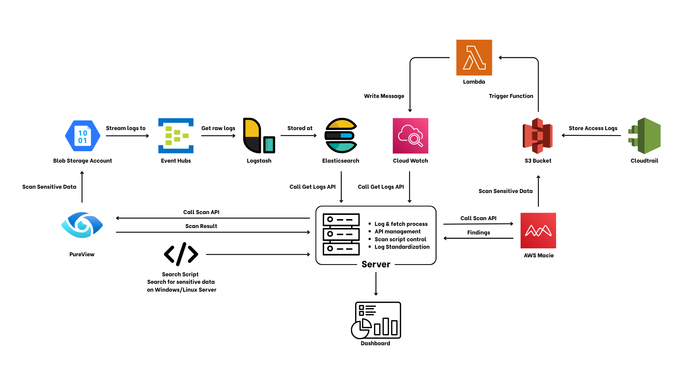

    # Data Security Posture Management on Cloud Storage
    

    ---

    <!-- ## 📚 Table of Contents
    - [Description](#-description)
    - [Architecture](#-architecture)
    - [Main Component Overview](#-main-component-overview)

    --- -->

    ## <!--📝--> Description

    This project is a **Data Security Posture Management (DSPM)** platform designed to operate across two major cloud storage services: **Azure Blob Storage** and **AWS S3**. The platform offers the following key features:

    - **Log Management**: Tracks activities such as file uploads, user modifications (capturing the usernames who made changes), and file downloads.
    - **Search and Scan**: Scans cloud storage repositories to identify files containing sensitive information.
    - **Server Scan**: Scans Windows servers to detect files that may contain sensitive data.

    The goal of this platform is to enhance visibility, monitoring, and security of data assets across hybrid cloud environments.

    ---

    ## <!--📋--> Architecture

    

    ---

    ## <!--🛠️--> Main Component Overview
    | Main Component | Description |
    | :------------- | :---------- |
    | **🔍 Log Management** | Collects and processes logs from Azure Storage and AWS S3. Extracts essential information like file uploads, downloads, access timestamps, and user actions. |
    | **☁️ Cloud Storage Scanner** | Utilizes Microsoft Purview for Azure and Amazon Macie for AWS to scan and detect sensitive data in stored files based on predefined patterns or user-defined keywords. |
    | **🖥️ Server Scanner** | Runs scripts on Windows and Linux servers to find sensitive information within file systems. Automatically triggers scans and reports results back to the backend. |
    | **🔗 Backend Server** | Handles API workflows, coordinates scan operations, processes raw logs, and provides structured data to the dashboard for visualization and monitoring. |
    | **📊 Dashboard** | Centralized UI for managing and visualizing processed logs and scan results. Supports searching, filtering, and real-time monitoring of data security posture across environments. |

    ## Progess Tracking

    **System Design**: 🟢 Completed

    **Main Components**
    | Module                | Status        | Progress |
    |----------------------|---------------|----------|
    | Log Management        | ✅ Completed | 100%      |
    | Cloud Storage Scanner | ✅ Completed | 100%      |
    | Server Scanner        | ✅ Completed   | 100%     |
    | Backend Server        | ✅ Completed | 100%  |
    | Dashboard             | ✅ Completed | 100%  |

    ---

    ### Notes / Challenges