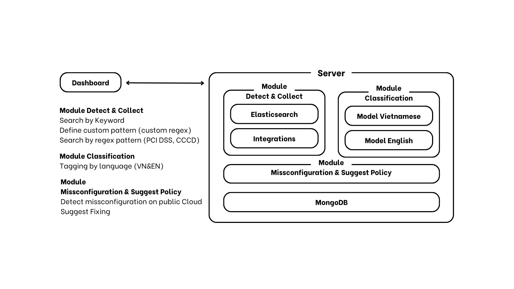
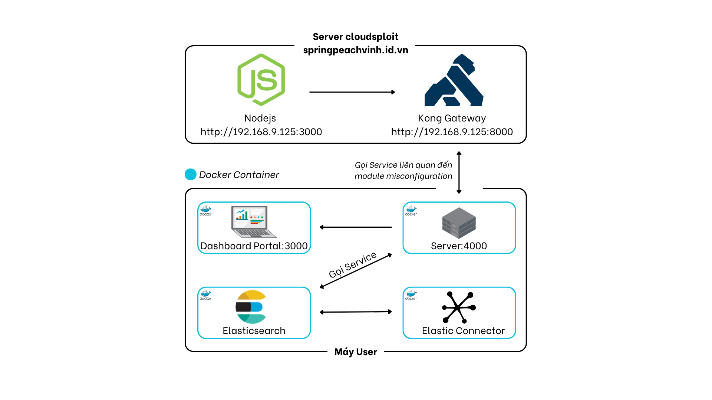

# Sensitive Data Detection System with Machine Learning-Based Classification for  Cloud and On-premises Storage
<!--  -->
---
<!-- ## 📚 Table of Contents
- [Description](#-description)
- [Architecture](#-architecture)
- [Main Component Overview](#-main-component-overview)
--- -->
## Description
This project focuses on developing a **Data Security Posture Management (DSPM)** system capable of detecting and classifying sensitive data stored across cloud and on-premise environments. It aims to offer a cost-effective, open-source, and language-aware alternative that addresses limitations in Vietnamese data handling and accessibility for small to medium-sized enterprises. The system also detects misconfigurations in cloud storage (e.g., Azure Blob, AWS S3) that may lead to data exposure and provides recommendations for remediation, contributing to stronger data governance and compliance.

---
## Architecture

### Functional Architecture

### Deployment Architecture

---
## Main Component Overview
| Main Component | Description |
| :------------- | :---------- |
| **Data Collection & Detection Module** | Collects and scans data from cloud (Azure Blob, AWS S3) and on-premise storages to detect sensitive information based on keywords, predefined or custom patterns (e.g., PCI DSS). |
| **Sensitive Data Classification Module** | Uses open-source machine learning models (Zero-shot Classification, PhoBERT) to automatically classify sensitive data in English and Vietnamese. |
| **Risk Detection & Remediation Module** | Identifies misconfigurations in cloud storage that could cause data exposure and provides actionable recommendations for remediation. |
| **Dashboard** | Provides a web-based interface for real-time monitoring, visualization, and management of scan results and risk assessments. |
## Progess Tracking
**System Design**: In-progress
**Main Components**
| Module                | Status        | Progress |
|----------------------|---------------|----------|
| Data Collection & Detection        | Completed | 100%      |
| Sensitive Data Classification | In-progress | 70%      |
| Risk Detection & Remediation      | In-progress   | 40%     |
| Dashboard             | In-progress | 60%  |
---
### Notes / Challenges